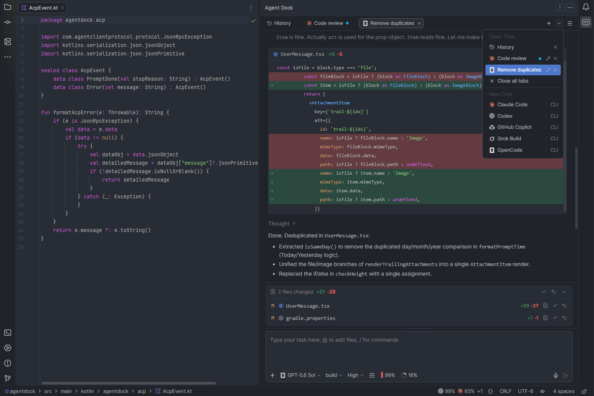

# Agent Dock

Agent Dock brings widely used AI coding agents into a unified GUI that follows the active JetBrains IDE theme.

The project's goal is to deliver a rich GUI experience for AI agents within JetBrains IDEs, including features absent from other JetBrains AI plugins, such as live token usage updates directly in the chat interface and switching between AI agents within the same chat while preserving session context.

Built-in AI agent integrations:

- Claude Code
- Codex
- Cursor
- GitHub Copilot
- Junie
- Google Antigravity
- Grok Build
- Kilo
- Kimi Code
- OpenCode v2
- Qoder

Any other ACP-compatible agent can be added through the custom configuration option.

## Features

- Manage integrated agents: install, update, remove, log in, and log out inside the plugin.
- Communication with AI agents through ACP (Agent Client Protocol) in a GUI.
- Connect any ACP-compatible agent using a custom configuration.
- View tool calls, thinking, terminal commands, plans, file edits, and diffs.
- Review, accept, or revert agent file changes.
- Receive audio notifications for chat and agent events.
- Use slash commands and reference project files through @ mentions.
- Add code selections and file references from the editor or project view.
- Paste images into chat. Preview pasted and agent-generated images full-screen.
- View live token quota and context usage in the chat input.
- Use voice input with GPT Transcriber, Gemini 3.5 Transcribe, or local Whisper.
- Continue chats in the IDE terminal.
- Find, reopen, and rename saved chats, or delete them individually or in bulk.
- Switch agents within a chat while preserving context.
- Fork chats from any point.
- Configure MCP servers for additional tools and resources.
- Save and insert reusable prompts.
- Queue prompts while an agent is working.
- Manage system instructions for agent sessions.
- Generate Git commit messages from current changes.

## Requirements

- JetBrains IDE 2026.2+ with Web Browser (JCEF) support.
- Some agents use JetBrains IDE terminal for authentication.
- On macOS and Linux, installing some agents requires `curl` and `tar`.

## Technology

- **Backend:** Kotlin
- **Frontend:** React, Tailwind
- **Agent communication:** ACP (Agent Client Protocol)

## Screenshot

